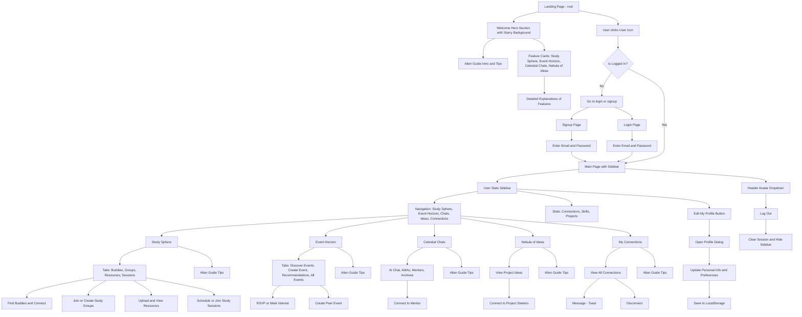

# 🌌 UniVerse – Your Cosmic Campus Companion

**Navigate your university journey like never before!** UniVerse is a space-themed, feature-rich platform designed to be your central hub for collaboration, events, mentorship, and innovation – all through an immersive, celestial interface.

[](https://opensource.org/licenses/MIT)

---

## 🌠 Overview

UniVerse brings together students, seniors, and alumni in one platform, offering features like peer finding, study group creation, AI guidance, and project matchmaking – all stored locally for a demo experience using `localStorage`.
This frontend-focused application is visually stunning and highly interactive, simulating a fully connected campus environment.

---
## Workflow-Flowchart :
<details>
<summary>📊 Flowchart Placeholder (Click to expand)</summary>



</details>

## 🪐 Core Features

UniVerse is organized into four primary feature modules, all navigable via a persistent sidebar:

### 1\. Study Sphere 🧑‍🚀🤝🧑‍🚀

* Customizable academic profiles (learning styles, skills, courses)
* Buddy Finder with filterable matching
* Local peer connections
* Group creation/joining
* Resource upload & sharing
* Study session scheduling
    *(All data stored locally)*

### 2\. Event Horizon 🗓️🔭

* Campus-wide and peer-hosted event discovery
* Keyword and tag-based filtering
* RSVP and mark interest features (persisted locally)
* Peer event creation with form validation
* Simulated event recommendations

### 3\. Celestial Chats 🤖💬

* Stellar Assist AI powered by Genkit (Google)
* Mentor/Alumni profiles and AMA sessions (mocked)
* Simulated mentor connection flows (local-only)

### 4\. Nebula of Ideas 💡🚀

* Browse student-led project ideas
* Simulated requests to connect and collaborate
* *(WIP) Form to submit and filter project ideas*
* *(Future) Real-time project team spaces*

## 👽 Unique Elements

* **Animated Starry Background** – Powered by `react-tsparticles`
* **Global Alien Guide** – Contextual animated helper across the app
* **Persistent Navigation Sidebar** – Shows user stats and access to all features
* **Mock Authentication System** – Simulates signup/login using `localStorage`

## 🛠️ Tech Stack

### Frontend

* [Next.js](https://nextjs.org/) 15+ (App Router)
* [React](https://react.dev/) 18+ with [TypeScript](https://www.typescriptlang.org/)
* [Tailwind CSS](https://tailwindcss.com/) + [ShadCN UI](https://ui.shadcn.com/)
* [Lucide Icons](https://lucide.dev/) + [Framer Motion](https://www.framer.com/motion/)
* [`react-tsparticles`](https://www.google.com/search?q=https://github.com/tsparticles/react-tsparticles) for starry background

### State & Persistence

* [React Context API](https://react.dev/learn/passing-data-deeply-with-context) for authentication
* `useState`, `useEffect` (React Hooks) for component-level state
* [`localStorage`](https://developer.mozilla.org/en-US/docs/Web/API/Window/localStorage) for user data persistence

### AI Integration

* [Genkit (Google)](https://genkit.dev/) – Powers the AI mentor/study assistant

## 🚀 Getting Started

### 1\. Prerequisites

* [Node.js](https://nodejs.org/en/) v18+
* [npm](https://www.npmjs.com/) / [yarn](https://yarnpkg.com/) / [pnpm](https://pnpm.io/)

### 2\. Clone & Install

```bash
git clone <repository-url>
cd <project-directory>
npm install  # or yarn / pnpm install
```

### 3\. Run Locally

```bash
npm run dev
# App usually runs at http://localhost:3000
```

### 4\. Environment Variables (Optional)

To enable live Genkit AI features, create a `.env` file:

```ini
GOOGLE_API_KEY=your_key_here
```

## 📁 Project Structure (Simplified)

```bash
uni-verse/
├── src/
│   ├── app/
│   │   ├── (feature-pages)/      # Feature routes: Study Sphere, Event Horizon, etc.
│   │   ├── my-connections/        # Connections dashboard
│   │   ├── layout.tsx             # Root layout with sidebar
│   │   └── page.tsx               # Main landing/dashboard
│   ├── components/
│   │   ├── AlienGuide.tsx
│   │   ├── UserStatsSidebar.tsx
│   │   └── StarryBackground.tsx
│   ├── contexts/                # Auth and other React contexts
│   ├── hooks/                   # Custom hooks
│   ├── lib/                     # Utility functions
│   └── ai/                      # Genkit AI flows
├── public/                      # Static assets
├── tailwind.config.ts
└── package.json
```

## 🔮 Roadmap & Future Scope

### ✅ Current

* Frontend demo with mock login/signup
* Persistent profiles, events, connections (via `localStorage`)
* Functional AI assistant
* Space-themed polished UI

### 🛸 Coming Soon

* Full backend integration (Firebase / Supabase)
* Real-time messaging, group collaboration, mentor chats
* Full "Nebula of Ideas" implementation
* Notifications system
* Improved mobile responsiveness
* AI-driven recommendations

## 🙏 Acknowledgements

Thank you for exploring UniVerse\! 🌌
We believe in transforming campus life by building connected, inspiring, and intelligent digital spaces for every student.
